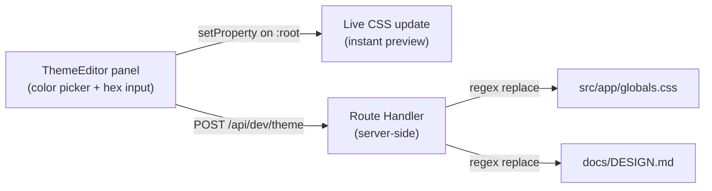

# Live Theme Editor

A dev-only floating panel that sits over the site, lets you tweak colors live, and saves them back to `globals.css` (and syncs `docs/DESIGN.md`) with one click.

## How it works

## Files to create/edit

- **Create** [`src/components/dev/ThemeEditor.tsx`](src/components/dev/ThemeEditor.tsx) — floating panel component
- **Create** [`src/app/api/dev/theme/route.ts`](src/app/api/dev/theme/route.ts) — POST handler that writes to `globals.css` and `DESIGN.md`
- **Edit** [`src/app/layout.tsx`](src/app/layout.tsx) — mount `<ThemeEditor />` inside a `NODE_ENV === 'development'` guard

## ThemeEditor component

- Floating toggle button (bottom-right corner) shows/hides the panel
- Colors are grouped by section (Brand, Ink, Surfaces, Hairlines, Semantic) matching the existing comment groups in `globals.css`
- Each row: token name + native `<input type="color">` + editable hex text input — both stay in sync
- Changes call `document.documentElement.style.setProperty('--color-token', value)` immediately for live preview
- "Save" button POSTs `{ colors: { "--color-primary": "#xxxx", ... } }` to the API route
- Initial values are hardcoded to match the current `globals.css` defaults (since Tailwind v4 `@theme inline` doesn't expose vars at runtime via `getComputedStyle`)

## API route

Receives `{ colors: { "--color-primary": "#xxxx", ... } }` and updates two files:

**`globals.css`**
- Reads the file, does a line-level regex replace for each `--color-xxx: #yyy;` entry
- Writes the file back — Next.js dev server HMR picks up the change automatically

**`docs/DESIGN.md`**
- The YAML frontmatter has `primary: "#0066cc"` — matched with `/(token-name:\s*)"#[0-9a-fA-F]{3,8}"/` per token and replaced
- The prose body has inline hex callouts like `(#0066cc)` — matched globally with the old hex value and replaced with the new one
- Returns `{ ok: true }` on success; only accessible in dev (returns 403 in production)

## A note on DESIGN.md evolution

The hex sync keeps the color table and inline callouts accurate automatically. However, `DESIGN.md` currently contains Apple-specific language throughout ("Action Blue", "SF Pro", "Apple tight", etc.) — that narrative layer is intentional design authorship and won't be touched by the tool. As you develop your own brand identity through experimentation, you can revisit the prose and rename tokens (e.g. rename "Action Blue" to whatever your accent color feels like). The tool keeps the hex values truthful; the words are yours to evolve.
